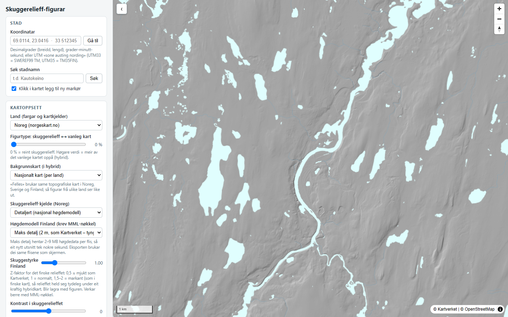

# Skuggerelieff-figurar

Nettside for å laga kartutsnitt frå Noreg, Sverige og Finland: **reint
skuggerelieff** eller **hybrid skuggerelieff / vanleg kart**, alltid med klår
blåfarge på vatn (inkludert småtjørner), standardiserte markørar, målestokk og
kjeldeline. Alt blir henta direkte frå dei opne karttenestene til Kartverket,
Lantmäteriet og Maanmittauslaitos.
(https://pomdre.net/skuggerelieff/)

## Slik startar du

Opne **`index.html`** i nettlesaren (dobbeltklikk på fila). Ingen installasjon
og ingen tenar – kartdata blir henta frå nettet medan du brukar sida.

Lagra figurar og API-nøkkelen ligg i nettlesaren (localStorage) og er knytte til
adressa sida er opna frå. Bruk *Eksporter liste (JSON)* under *Lagra figurar*
om du vil ta figurane med deg til ei anna maskin eller ein annan nettlesar.

## Arbeidsflyt for éin figur

1. **Stad**: Lim inn koordinatar (t.d. `69.0114, 23.0416`, grader-minutt-sekund
   eller UTM `33 512345 7654321`) og trykk *Gå til* – eller søk på stadnamn,
   eller klikk rett i kartet. Kvart klikk/oppslag legg til ein ny markør, så
   ein figur kan ha fleire markørar. Kvar markør kan vera kryss (×), prikk (●)
   eller ring (○) – vel type for nye markørar i *Markørar*-panelet, og byt type
   på ein enkeltmarkør med veljaren i markørlista. Markørane kan dragast i
   kartet for finjustering.
2. **Utsnitt**: Panorer og zoom i kartet til utsnittet er slik du vil ha det.
   Vel eventuelt eit fast format (3:4, A4 osb.) under *Eksport*. Kartet kan
   roterast (glidar eller Ctrl + dra), og menylinja kan skjulast med tasten
   **M** for å sjå utsnittet stort.
3. **Figurtype**: Dra glidebrytaren *skuggerelieff ⟷ vanleg kart* til den
   blandinga du vil ha (0 % = reint skuggerelieff, høgare = meir av det vanlege
   kartet oppå).
4. **Vatn**: Standardfargane er lesne frå det nasjonale kartverket for valt land
   (for Noreg er dei tekne direkte frå flisene til norgeskart.no). Dei kan
   justerast fritt med fargeveljarane.
5. **Eksport**: Vel breidd i pikslar og trykk *Last ned PNG*. Fila får med seg
   markørar, målestokk, eventuell nordpil og kjeldeline.
6. **Lagra figuren**: Gje han namn og trykk *Lagra*. Då kan du seinare opna
   figuren att med nøyaktig same utsnitt og innstillingar, endra det som
   trengst, og eksportera på nytt. Lista kan eksporterast/importerast som
   JSON-fil om ho skal delast eller sikrast.

## Kjelder

| Kva | Kjelde |
|---|---|
| Skuggerelieff Noreg | Kartverket, nasjonal høgdemodell (detaljert) eller «fjellskygge» (generalisert) |
| Skuggerelieff Sverige | Lantmäteriet, «terrängskuggning» frå den svenske høgdemodellen |
| Skuggerelieff Finland | Maanmittauslaitos, 2 m-høgdemodell (korkeusmalli 2 m, via WCS) med gratis API-nøkkel; elles global høgdemodell (EU-DEM) |
| Vanleg kart Noreg | Kartverket topografisk kart (same som norgeskart.no) |
| Vanleg kart Sverige | Lantmäteriet topowebb (same som minkarta.lantmateriet.se) |
| Vanleg kart Finland | OpenTopoMap som standard; Maanmittauslaitos maastokartta med gratis API-nøkkel (sjå under) |
| Vassflater, elvar og vassnamn | OpenStreetMap/OpenMapTiles (vektordata – difor skarpe i alle oppløysingar) |

### Noreg og Sverige – inkje oppsett naudsynt

Kart og skuggerelieff for Noreg og Sverige blir henta frå Kartverket og
Lantmäteriet sine opne visningstenester (dei same som norgeskart.no og
minkarta.lantmateriet.se brukar), heilt utan nøkkel eller registrering.

### Vatn – nasjonalt vs. OpenStreetMap

Under *Vatn* kan du velja vasskjelde:

- **Noreg**: «Nasjonalt kart» hentar vassflater og elvar frå same kart som
  norgeskart.no – nøyaktige linjer og rett blåfarge, òg i reint skuggerelieff.
- **Sverige/Finland**: Det finst ikkje eit ope nasjonalt vatn-lag der, så vatnet
  kjem frå OpenStreetMap. Den nedlasta figuren får då nøyaktig same vatn som du
  ser på skjermen. Vil du i tillegg ha vassflatene frå det nasjonale kartet
  (Lantmäteriet / OpenTopoMap / MML) plukka ut i full oppløysing og lagde oppå,
  kryss av **«Hent ekstra vatn frå kartet»** under *Eksport*. Det gjev meir
  komplett vatn, men då inneheld fila meir vatn enn førehandsvisinga.
  «OpenStreetMap»-valet gjev i tillegg justerbar blåfarge.

### Felles bakgrunnskart

Under *Kartoppsett* → *Bakgrunnskart* kan du velja «Felles for alle land
(OpenTopoMap)». Då brukar Noreg, Sverige og Finland same topografiske kart i
hybridmodus, så figurar frå ulike land ser like ut.

### Finland – API-nøkkel (tilrådd)

Med ein gratis nøkkel frå Maanmittauslaitos (MML) får Finland same kvalitet som
Noreg og Sverige:

- **Skuggerelieff** frå MML sin 2 m-høgdemodell. Høgdene blir henta frå
  WCS-tenesta i det finske rutenettet (ETRS-TM35FIN), reprojiserte og skuggelagde
  i nettlesaren (Web Workers) med 4× superprøvetaking, lys frå nordvest og same grå
  grunntone som Kartverket/Lantmäteriet. Under *Kartoppsett* → *Høgdemodell Finland*
  vel du «Maks detalj» (2 m-data, skuggen rekna på dobbelt rutenett og nedskalert –
  måla skarpare enn Kartverket sitt relieff, men 2–9 MB per flis) eller «Rask»
  (4–8 m, lettare å panorera). Glidaren *Skuggestyrke Finland* (z-faktor, lagra
  per figur) gjev mjukt (0,5), normalt (1) eller markant (1,5–2) relieff – det siste
  held relieffet tydeleg under eit kraftig hybridkart. Utanfor Finland (over grensa)
  blir høgdene fylte inn frå den globale høgdemodellen, med mjuk overgang;
  kjeldelina seier då frå.
- **Bakgrunnskart** i hybrid: MML sitt eige kart (maastokartta).

Utan nøkkel brukar Finland den globale høgdemodellen (EU-DEM, ~25 m) og OpenTopoMap.
Nøkkel: registrer deg på omatili.maanmittauslaitos.fi, opprett ein nøkkel for
«avoimet rajapintapalvelut» og lim han inn under *Avansert*. Nøkkelen blir lagra
i nettlesaren.

## Teknisk

Rein statisk nettside (`index.html`, `app.js`, `style.css`) bygd på MapLibre GL.
Ingen byggjesteg – kartdata blir henta direkte frå dei opne tenestene over, og
det finske skuggerelieffet blir rekna i nettlesaren (Web Workers, geotiff.js).
Lagra figurar ligg i nettlesaren (localStorage).
